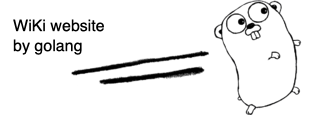

<!-- Improved compatibility of back to top link: See: https://github.com/othneildrew/Best-README-Template/pull/73 -->
<a id="readme-top"></a>
<!--
*** Thanks for checking out the Best-README-Template. If you have a suggestion
*** that would make this better, please fork the repo and create a pull request
*** or simply open an issue with the tag "enhancement".
*** Don't forget to give the project a star!
*** Thanks again! Now go create something AMAZING! :D
-->


<!-- PROJECT SHIELDS -->
<!--
*** I'm using markdown "reference style" links for readability.
*** Reference links are enclosed in brackets [ ] instead of parentheses ( ).
*** See the bottom of this document for the declaration of the reference variables
*** for contributors-url, forks-url, etc. This is an optional, concise syntax you may use.
*** https://www.markdownguide.org/basic-syntax/#reference-style-links
-->
[![Contributors][contributors-shield]][contributors-url]
[![Forks][forks-shield]][forks-url]
[![Stargazers][stars-shield]][stars-url]
[![Issues][issues-shield]][issues-url]
[![MIT License][license-shield]][license-url]
[![LinkedIn][linkedin-shield]][linkedin-url]


<!-- PROJECT LOGO -->
<br />
<div align="center">
  <a href="https://github.com/whatafunc/golang-wiki-website">
    
  </a>

<h3 align="center">WiKi website powered by Golang that uses templates</h3>

  <p align="center">
    Got inspired by the following article in the go docs: 
    <br />
    <a href="go.dev/doc/articles/wiki"><strong>Go lang dev docs »</strong></a>
    <br />and when noticed this Question on Stack Overflow
    <a href="https://stackoverflow.com/questions/63443305/how-can-i-use-multiple-html-templates-ie-have-a-base-template-or-footer-templa"><strong>How can I use multiple html templates (ie. have a base template or footer template) in Go? »</strong></a>
    <br />
    <p>View Demo by compiling this code and get in touch:</p>
    <a href="https://github.com/whatafunc/golang-wiki-website/issues/new?labels=bug&template=bug-report---.md">Report Bug</a>
    ·
    <a href="https://github.com/whatafunc/golang-wiki-website/issues/new?labels=enhancement&template=feature-request---.md">Request Feature</a>
  </p>
</div>


<!-- TABLE OF CONTENTS -->
<details>
  <summary>Table of Contents</summary>
  <ol>
    <li>
      <a href="#about-the-project">About The Project</a>
      <ul>
        <li><a href="#built-with">Built With</a></li>
      </ul>
    </li>
    <li>
      <a href="#getting-started">Getting Started</a>
      <ul>
        <li><a href="#prerequisites">Prerequisites</a></li>
        <li><a href="#installation">Installation</a></li>
      </ul>
    </li>
    <li><a href="#usage">Usage</a></li>
    <li><a href="#roadmap">Roadmap</a></li>
    <li><a href="#contributing">Contributing</a></li>
    <li><a href="#license">License</a></li>
    <li><a href="#contact">Contact</a></li>
    <li><a href="#acknowledgments">Acknowledgments</a></li>
  </ol>
</details>


<!-- ABOUT THE PROJECT -->
## About The Project

Golang is used for many areas and in this case is working as a webserver and the web app with templates

<p align="right">(<a href="#readme-top">back to top</a>)</p>


### Built With

* [![go][go.dev]][golang-url]
 

<p align="right">(<a href="#readme-top">back to top</a>)</p>


<!-- GETTING STARTED -->
## Getting Started

Just use this repo and start it locally

### Prerequisites

* bash
  ``` 
  git clone https://github.com/whatafunc/golang-wiki-website.git
  go run filetest.go 
  ```

### Installation

1. install git
2. Clone the repo
   ```sh
   git clone https://github.com/whatafunc/golang-wiki-website.git
   ```
3. Install Go engine
   ```sh
   brew install go
   ```
4. run your go webserver `go run filetest.go `
   ```sh
   go run filetest.go 
   ```
5. visit 
   ```
   http://localhost:8000/
   ```

<p align="right">(<a href="#readme-top">back to top</a>)</p>


<!-- USAGE EXAMPLES -->
## Usage

Just browse the links and either view or edit the pages of the small WiKi like local website

<p align="right">(<a href="#readme-top">back to top</a>)</p>


<!-- ROADMAP -->
## Roadmap

- [x] release
- [ ] add some json and do fuzz tests 
- [ ] dev unit tests for go
    - [ ] unit test go 

See the [open issues](https://github.com/whatafunc/tweaking-a-stackoverflow-example-in-go/issues) for a full list of proposed features (and known issues).

<p align="right">(<a href="#readme-top">back to top</a>)</p>


<!-- CONTRIBUTING -->
## Contributing

Contributions are what make the open source community such an amazing place to learn, inspire, and create. Any contributions you make are **greatly appreciated**.

If you have a suggestion that would make this better, please fork the repo and create a pull request. You can also simply open an issue with the tag "enhancement".
Don't forget to give the project a star! Thanks again!

1. Fork the Project
2. Create your Feature Branch  
3. Commit your Changes 
4. Push to the Branch 
5. Open a Pull Request

<p align="right">(<a href="#readme-top">back to top</a>)</p>

### Top contributors:

<a href="https://github.com/github_username/repo_name/graphs/contributors">
  
</a>


<!-- LICENSE -->
## License

Distributed under the MIT License. See `LICENSE.txt` for more information.

<p align="right">(<a href="#readme-top">back to top</a>)</p>

 

<!-- ACKNOWLEDGMENTS -->
## Acknowledgments

* [go.dev](go.dev)
* [stackoverflow.co/](https://stackoverflow.co/)

<p align="right">(<a href="#readme-top">back to top</a>)</p>